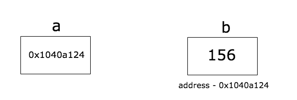

15 - 指针  
========================

上一节：[第十四篇 字符串](/docs/golang_tutorial_14.md)   
下一节：[第十六篇 结构体](/docs/golang_tutorial_16.md)  

这是本Golang系列教程的第15篇。我们将学习 Go 语言中指针的作用，并且将 Go 指针与其他语言（如 C/C++）的指针进行区分。

## 什么是指针？

指针是存储一个变量的内存地址的变量。  

  

在上图中，变量 `b` 的值是 `156`，存储在地址为 `0x1040a124` 的内存中。变量 `a` 存储了变量 `b` 的地址，也可以说 `a` 指向 `b`。  

## 指针的声明  

指向类型 `T` 的指针用 `*T` 表示。  

让我们写一些代码。

```golang
package main

import (  
    "fmt"
)

func main() {  
    b := 255
    var a *int = &b
    fmt.Printf("Type of a is %T\n", a)
    fmt.Println("address of b is", a)
}
```

`&` 操作符用来获取一个变量的地址。在上面的程序中，第 9 行我们将 `b` 的地址赋给 `a`（`a` 的类型为 `*int`）。现在我们说 `a` 指向了 `b`。当我们打印 `a` 的值时，`b` 的地址将会被打印出来。程序的输出为：

```
Type of a is *int
address of b is 0x1040a124
```

你可能得到的是一个不同的 `b` 的地址，因为 `b` 可能被存储在内存的任意一个地方。  

## 指针的空值  

指针的空值为 `nil`。  

```golang
package main

import (  
    "fmt"
)

func main() {  
    a := 25
    var b *int
    if b == nil {
        fmt.Println("b is", b)
        b = &a
        fmt.Println("b after initialization is", b)
    }
}
```

'b' 首先被初始化为 `nil`，之后被赋值为 `a` 的地址，程序输出为：

```golang
b is <nil>  
b after initialization is 0x1040a124
```

## 利用 `new` 函数创建指针

Go 还提供一个实用的函数 `new` 来创建指针。`new` 函数接收一个类型，并返回一个该类型的空值指针。

我们来看一个实例：

```golang
package main

import (  
    "fmt"
)

func main() {  
    size := new(int)
    fmt.Printf("Size value is %d, type is %T, address is %v\n", *size, size, size)
    *size = 85
    fmt.Println("New size value is", *size)
}
```

上面的程序中，我们在第 8 行利用 `new` 函数创建了一个指向 `int` 类型的指针。由于 `int` 类型的空值为 `0`，变量 `size` 是一个指向 `0` 的整数指针（`*int` 类型）。

程序输出：

```golang
Size value is 0, type is *int, address is 0x414020  
New size value is 85
```

## 指针的间接引用

间接引用（dereference）指针就是获取指针所指向的变量的值。间接引用 `a` 的语句是 `*a`。例如：

```golang
package main  
import (  
    "fmt"
)

func main() {  
    b := 255
    a := &b
    fmt.Println("address of b is", a)
    fmt.Println("value of b is", *a)
}
```

在第 10 行，我们间接引用了 `a` 并打印了它的值，也就是 `b` 的值。程序输出为：

```golang
address of b is 0x1040a124  
value of b is 255  
```

我们再编写一个利用指针改变变量 `b` 的值的程序：

```golang
package main

import (  
    "fmt"
)

func main() {  
    b := 255
    a := &b
    fmt.Println("address of b is", a)
    fmt.Println("value of b is", *a)
    *a++
    fmt.Println("new value of b is", b)
}
```

在第 12 行，我们将 `a` 所指向的值加上了 1，也就是改变了 `b` 的值（因为 `a` 指向 `b`）。因此 `b` 变成了256，程序输出：

```golang
address of b is 0x1040a124  
value of b is 255  
new value of b is 256  
```

## 将指针传入函数

```golang
package main

import (  
    "fmt"
)

func change(val *int) {  
    *val = 55
}
func main() {  
    a := 58
    fmt.Println("value of a before function call is",a)
    b := &a
    change(b)
    fmt.Println("value of a after function call is", a)
}
```

在第 14 行，我们将存有 `a` 的地址的指针 `b` 传入了 `change` 函数。`change` 函数通过间接引用的方法改变了 `a` 的值，程序输出：

```golang
value of a before function call is 58  
value of a after function call is 55 
```

## 从函数中返回指针

从函数中返回一个局部变量的指针是完全可以的，Go 语言的编译器会将这个变量分配到堆中。

```golang
package main

import (  
    "fmt"
)

func hello() *int {  
    i := 5
    return &i
}
func main() {  
    d := hello()
    fmt.Println("Value of d", *d)
}
```

在第 9 行中，我们从 `hello` 函数中返回了局部变量 `i` 的地址。 **该操作在 C/C++ 等语言中是未定义的，因为一旦 `hello` 函数执行“返回”之后，变量 `i` 就不再存在于当前域（scope）内了。但是在 Go 语言中，编译器会进行“逃逸分析”（escape analysis）并且在地址离开当前域时将 `i` 分配到堆中。** 因此这一程序可以运行，输出为：

```golang
Value of d 5
```

## 不要将指向数组的指针传入函数中！要用切片

假设我们想要在一个函数内部对一个数组进行更改，一种实现方法是将一个指向数组的指针传入函数。

```golang
package main

import (  
    "fmt"
)

func modify(arr *[3]int) {  
    (*arr)[0] = 90
}

func main() {  
    a := [3]int{89, 90, 91}
    modify(&a)
    fmt.Println(a)
}
```

在第 13 行，我们将数组 `a` 的地址传入 `modify` 函数。在第 8 行，`modify` 函数内，我们间接引用了 `arr` 并且将数组的第一个元素改为 `90`。这个程序会输出：`[90 90 91]`。

**a[x] 是 (\*a)[x] 的简写形式，所以上面程序中的 (\*arr)[0] 可以被 arr[0] 代替。** 我们用简写方法重写这个程序：

```golang
package main

import (  
    "fmt"
)

func modify(arr *[3]int) {  
    arr[0] = 90
}

func main() {  
    a := [3]int{89, 90, 91}
    modify(&a)
    fmt.Println(a)
}
```

这个程序也会输出：`[90 90 91]`。

**尽管我们可以通过将指向数组的指针传入函数中来对数组进行修改，但是这在 Go 语言中并不是地道的方式，我们应该用切片来解决这类问题。**

我们用切片来重写之前的程序：

```golang
package main

import (  
    "fmt"
)

func modify(sls []int) {  
    sls[0] = 90
}

func main() {  
    a := [3]int{89, 90, 91}
    modify(a[:])
    fmt.Println(a)
}
```

在第 13 行，我们将一个切片传入了 `modify` 函数，这个函数将切片的第一个元素改为 `90`，程序输出仍然是：`[90 90 91]`。 **因此，不要再把指向数组的指针传入函数了，应该使用的是切片 :)**

## Go 不支持指针的算术运算

不像 C/C++ 中的指针可以进行算术运算，Go 语言并不支持指针算术运算。

```golang
package main

func main() {  
    b := [...]int{109, 110, 111}
    p := &b
    p++
}
```

上面的程序会出现编译错误：`main.go:6: invalid operation: p++ (non-numeric type *[3]int)`。

我（原文作者）在 [github](https://github.com/golangbot/pointers) 上创建了一个简单的小程序，包含了我们这次所学的全部内容。
